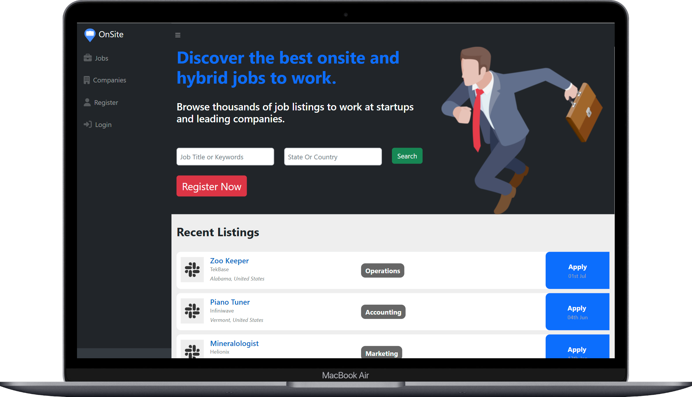

<!-- PROJECT LOGO -->

     
    

<h3 align="center">OnSite</h3> 
    

        The only career platform dedicated to hybrid and onsite jobs
    
 

<!-- TABLE OF CONTENTS -->

  
Table of Contents

  <ol>
    <li>
      <a href="#about-the-project">About The Project</a> 
    </li>
    <li><a href="#built-with">Built With</a></li>
    <li><a href="#installation">Installation</a></li>
    <li><a href="#contact">Contact</a></li>
  </ol>

 

   

<!-- ABOUT THE PROJECT -->
## About The Project

While there are many apps for remote jobs, there are none solely dedicated to onsite jobs. <strong>OnSite</strong> is a career platform that focuses on hybrid and onsite job opportunities, making it the ideal platform for job seekers like myself.
  
This platform provides a centralized place for people seeking onsite or hybrid work environments, catering to a growing demand for such opportunities.
  

[Live App](https://onsiteapp.pythonanywhere.com/) ·
[Report Bug](mailto:adrianjohn.developer@gmail.com?subject=I%20found%20a%20bug) ·
[Request Feature](mailto:adrianjohn.developer@gmail.com?subject=I%20want%20a%20feature)

    

## Built With 
[![Django][Django]][Django-url] [![Python][Python]][Python-url] [![SQL Server][SQL-Server]][SQL-Server-url]

[![HTML][HTML]][HTML-url] [![CSS][CSS]][CSS-url] [![JavaScript][JavaScript]][JavaScript-url]  

[![jQuery][jQuery]][jQuery-url] [![Bootstrap][Bootstrap]][Bootstrap-url]

[![Git][Git]][Git-url] [![Docker][Docker]][Docker-url] [![AWS S3][AWS-S3]][AWS-S3-url]

[Django]: https://img.shields.io/badge/Django-092E20?style=for-the-badge&logo=django&logoColor=white
[Django-url]: https://www.djangoproject.com/

[Python]: https://img.shields.io/badge/Python-3776AB?style=for-the-badge&logo=python&logoColor=white
[Python-url]: https://www.python.org/

[SQL-Server]: https://img.shields.io/badge/SQL%20Server-CC2927?style=for-the-badge&logo=microsoft-sql-server&logoColor=white
[SQL-Server-url]: https://www.microsoft.com/en-us/sql-server

[HTML]: https://img.shields.io/badge/HTML5-E34F26?style=for-the-badge&logo=html5&logoColor=white
[HTML-url]: https://developer.mozilla.org/en-US/docs/Web/HTML

[CSS]: https://img.shields.io/badge/CSS3-1572B6?style=for-the-badge&logo=css3&logoColor=white
[CSS-url]: https://developer.mozilla.org/en-US/docs/Web/CSS

[JavaScript]: https://img.shields.io/badge/JavaScript-F7DF1E?style=for-the-badge&logo=javascript&logoColor=black
[JavaScript-url]: https://developer.mozilla.org/en-US/docs/Web/JavaScript

[jQuery]: https://img.shields.io/badge/jQuery-0769AD?style=for-the-badge&logo=jquery&logoColor=white
[jQuery-url]: https://jquery.com/

[Bootstrap]: https://img.shields.io/badge/Bootstrap-563D7C?style=for-the-badge&logo=bootstrap&logoColor=white
[Bootstrap-url]: https://getbootstrap.com/

[Git]: https://img.shields.io/badge/Git-F05032?style=for-the-badge&logo=git&logoColor=white
[Git-url]: https://git-scm.com/

[Docker]: https://img.shields.io/badge/Docker-2496ED?style=for-the-badge&logo=docker&logoColor=white
[Docker-url]: https://www.docker.com/

[AWS-S3]: https://img.shields.io/badge/AWS%20S3-232F3E?style=for-the-badge&logo=amazon-aws&logoColor=white
[AWS-S3-url]: https://aws.amazon.com/s3/

[#MVC]() &#8202; 
[#Git]() &#8202; 
[#Containerization]() &#8202;
[#cloud ]() &#8202;
[#GIT]() &#8202;
[#CI/CD]() &#8202;
[# AWS S3 ]() &#8202;
[# ORMs ]() &#8202; 

## Installation

    Coming Soon

<!-- Developer Contact -->
## Contact

Feel free to reach out!

### Adrian John

[![linkedin][linkedin]][linkedin-url] 
[![gmail][gmail]](mailto:adrianjohn.developer@gmail.com)
  
#### My Email: adrianjohn.developer@gmail.com 

#### My Website: [adrianjohn.dev](https://adrianjohn.dev)

[linkedin]: https://img.shields.io/badge/LinkedIn-0077B5?style=for-the-badge&logo=linkedin&logoColor=white
[linkedin-url]: https://linkedin.com/in/dev-adrian

[gmail]:https://img.shields.io/badge/Gmail-D14836?style=for-the-badge&logo=gmail&logoColor=white
 
 